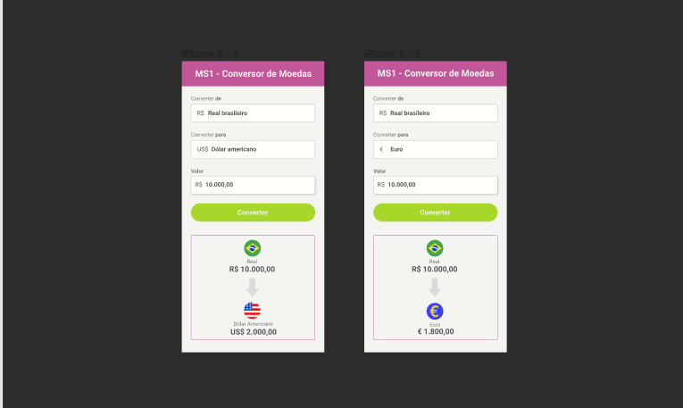

# Currency-converter
Currency converter to euro, dollar. project under construction!!

<h3>Final result:</h3>

 
 

## Tasks performed:

- [x] creation HTML

- [x] Stylization CSS

- [ ] Responsiveness

- [ ] Update it in real time

remarks : this project is old , so it is not completely up to date , project made in portuguese

<h4>To see another project <a href="https://github.com/izabela-guimaraes/PlayStation-Store" 
target="blank">click here</a></h4>

<a href="https://www.figma.com/file/9JDIdFDjYDVL5VGzw8Mc4b/Mission-One---Convert-Money?node-id=25%3A104">Figma link</a>

🚀 Technologies

This project was developed with the following technologies:
 

-Html
 
-Css
 
-JavaScript
 

## 🤝  Contributors

We thank the following people who contributed to this project:

- Project developed through the Code Club course

<table>
  <tr>
    <td align="center">
      <a href="#">
         
        
          <b>Izabela Guimarães</b>
        
      </a>
    </td>
        <td align="center">
      <a href="#">
        
         
        
          <b>Code Club</b>
        
      </a>
    </td>
</table>

 

